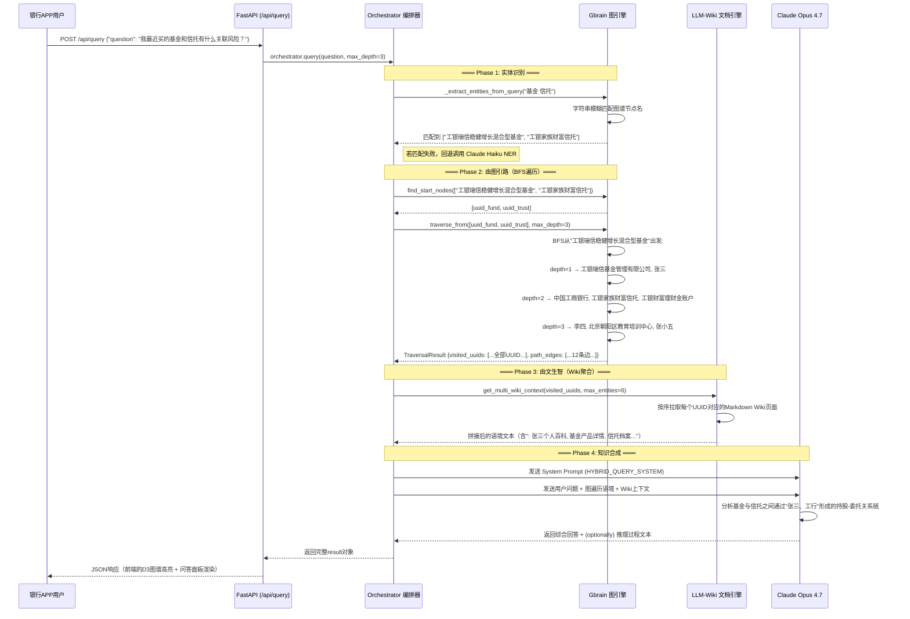

# 银行 APP 用户交互测试

## 基于 VGD Memory OS（Gbrain + LLM-Wiki）图文一体化记忆系统

---

**测试版本**：VGD Memory OS v1.0.0
**测试对象**：银行 APP 智能客服与用户画像记忆模块
**测试日期**：2026-05-07
**测试人员**：
**测试环境**：Python 3.10+ / Anthropic API / FastAPI / D3.js 前端

---

## 目录

1. [测试数据构造规范](#1-测试数据构造规范)
2. [Gbrain 与 LLM-Wiki 协作流程](#2-gbrain-与-llm-wiki-协作流程)
3. [记忆转化机制说明](#3-记忆转化机制说明)
4. [后端测试重点模块](#4-后端测试重点模块)
5. [前端交互测试要点](#5-前端交互测试要点)
6. [测试用例汇总](#6-测试用例汇总)
7. [测试结果记录](#7-测试结果记录)

---

## 1. 测试数据构造规范

### 1.1 数据模型映射关系

银行 APP 业务场景下的实体类型与 VGD 系统数据模型映射如下：

| 业务实体 | Graph 节点 Label | Wiki 文档类型 | 核心关系类型 |
|---------|-----------------|--------------|------------|
| 银行客户 | `PERSON` | 客户个人百科 | `holds_account`, `applied_for` |
| 银行账户 | `ACCOUNT` | 账户档案 | `belongs_to`, `transacted_with` |
| 金融产品 | `PRODUCT` | 产品详情页 | `purchased`, `recommended` |
| 交易记录 | `EVENT` | 交易流水摘要 | `transacted_at`, `involved` |
| 银行网点 | `LOCATION` | 网点服务指南 | `located_at`, `served_by` |
| 客户经理 | `PERSON` | 经理服务档案 | `assigned_to`, `managed_by` |
| 营销活动 | `EVENT` | 活动记录 | `participated_in`, `targeted_at` |
| 风控规则 | `OTHER` | 规则说明文档 | `triggered_by`, `applied_to` |

### 1.2 三元组数据格式规范

每条测试输入需遵循 `(Subject, Predicate, Object)` 语义结构，通过 Claude Haiku 4.5 NER 引擎自动抽取。手动构造测试数据时，应确保包含以下要素：

```json
// 三元组标准格式（引擎输出）
{
  "subject": "实体名称",
  "subject_label": "PERSON|ACCOUNT|PRODUCT|EVENT|LOCATION|OTHER",
  "predicate": "关系谓词（动词短语，小写蛇形）",
  "object": "实体名称",
  "object_label": "PERSON|ACCOUNT|PRODUCT|EVENT|LOCATION|OTHER"
}
```

### 1.3 测试数据生成规则

| 规则编号 | 规则名称 | 说明 |
|---------|---------|------|
| R001 | 实体唯一性 | 同一业务实体的名称在不同测试用例中应保持一致（如 "张三" 始终为同一UUID） |
| R002 | 关系可追溯 | 每个三元组的 predicate 必须能在图谱中形成连通路径，不可存在悬挂节点 |
| R003 | 时序一致性 | 涉及时间线的事件须符合逻辑先后顺序（如先开户后交易） |
| R004 | 标签准确性 | Label 须严格对应实际业务类型，误标会导致前端图例颜色错误 |
| R005 | 交叉引用 | 文本中应包含 `[[实体名]]` 形式的交叉引用以触发 Wiki 超链接绑定 |
| R006 | 覆盖度要求 | 每组测试数据至少覆盖 3 种以上实体 Label，确保多跳推理可验证 |

### 1.4 测试数据集

#### 数据集 1：个人理财咨询场景

```text
张三是一位38岁的企业中层管理者，在中国工商银行北京分行营业部开立了工银财富理财金账户（卡号：6212****8888）。
2026年3月15日，张三通过工行手机银行APP购买了100万元"工银瑞信稳健增长混合型基金"（基金代码：012345），
该基金由工银瑞信基金管理有限公司发行，风险等级为R3中风险。
2026年4月20日，张三收到客户经理李四（工号：GH1001，工行北京分行金牌理财师）的专属推荐，
通过APP线上签约了"工银家族财富信托"服务，受益人为其子女张小五（12岁，北京市第一中学学生）。
2026年5月6日，张三在工行手机银行APP上通过指纹验证方式成功办理了一笔20万元转账，
收款方为"北京朝阳区教育培训中心"，用途标注为"子女课外辅导费用"。
```

**预期生成的图谱结构**：

```
(张三: PERSON) --[holds_account]--> (工银财富理财金账户: ACCOUNT)
(张三: PERSON) --[purchased]--> (工银瑞信稳健增长混合型基金: PRODUCT)
(张三: PERSON) --[signed]--> (工银家族财富信托: PRODUCT)
(张三: PERSON) --[assigned_to]--> (李四: PERSON)
(工银瑞信稳健增长混合型基金: PRODUCT) --[issued_by]--> (工银瑞信基金管理有限公司: COMPANY)
(工银家族财富信托: PRODUCT) --[provided_by]--> (中国工商银行: COMPANY)
(张三: PERSON) --[beneficiary]--> (张小五: PERSON)
(张小五: PERSON) --[studies_at]--> (北京市第一中学: LOCATION)
(张三: PERSON) --[transacted]--> (北京朝阳区教育培训中心: LOCATION)
(张三: PERSON) --[visited]--> (中国工商银行北京分行营业部: LOCATION)
(李四: PERSON) --[works_at]--> (中国工商银行北京分行营业部: LOCATION)
```

---

#### 数据集 2：企业信贷审批场景

```text
王建国（55岁）是北京建工科技发展有限公司（统一社会信用代码：91110108******）的法定代表人兼总经理，
该公司成立于2010年，注册资本5000万元，属于高新技术企业，在中国工商银行中关村支行开立对公结算账户。
2025年12月，王建国通过工行企业网银提交了800万元"科创贷"流动资金贷款申请，
贷款用途为"新一代建筑信息模型（BIM）软件研发项目"。
2026年1月，工行中关村支行普惠金融部客户经理赵六完成现场尽调，评估报告显示：
该公司近三年营收复合增长率28%，资产负债率45%，在建项目3个，研发投入占比达营收的15%。
2026年2月，经工行北京分行信贷审批委员会审议通过，该笔贷款成功放款，期限2年，年利率3.85%，
担保方式为"法定代表人连带责任保证+知识产权质押"。
王建国的配偶陈芳（50岁）在同一家公司担任财务总监，两人共同持有公司75%的股权。
```

**预期生成的图谱结构**：

```
(王建国: PERSON) --[legal_representative]--> (北京建工科技发展有限公司: COMPANY)
(王建国: PERSON) --[holds_position]--> (北京建工科技发展有限公司: COMPANY)  // pos: 总经理
(北京建工科技发展有限公司: COMPANY) --[holds_account]--> (对公结算账户: ACCOUNT)
(北京建工科技发展有限公司: COMPANY) --[located_at]--> (中国工商银行中关村支行: LOCATION)
(王建国: PERSON) --[applied_for]--> (科创贷流动资金贷款: PRODUCT)
(科创贷流动资金贷款: PRODUCT) --[approved_by]--> (工行北京分行信贷审批委员会: LOCATION)
(赵六: PERSON) --[conducted]--> (现场尽职调查: EVENT)
(赵六: PERSON) --[works_at]--> (中国工商银行中关村支行: LOCATION)
(王建国: PERSON) --[spouse]--> (陈芳: PERSON)
(陈芳: PERSON) --[holds_position]--> (北京建工科技发展有限公司: COMPANY)  // pos: 财务总监
(王建国: PERSON) --[co_holds]--> (北京建工科技发展有限公司: COMPANY)
```

---

#### 数据集 3：信用卡风控预警场景

```text
刘芳（32岁，工银信用卡白金卡用户，卡号：5234****5678，固定额度10万元）在2026年4月的账单周期内
出现异常用卡行为：4月10日至4月15日期间，连续在三个不同城市的商户发生大额消费，
分别为广州天河区某珠宝店（38,000元）、武汉江汉区某电子卖场（42,000元）、沈阳和平区某奢侈品店（35,000元）。
4月16日，工行信用卡风控系统（模型编号：ICBC-CC-2026-RF-v3）判定该行为触发"跨地域短时高频交易"预警规则，
自动对该卡实施临时止付，并向刘芳的手机银行APP推送了风险确认通知。
刘芳于4月17日通过工行手机银行APP的"风险确认"通道完成了人脸识别验证，确认4月10-15日期间
其本人实际在广州市参加行业展会，武汉和沈阳的交易为家庭成员（其丈夫周明，38岁，IT工程师）持有该卡副卡消费。
风控系统在验证通过后自动解除止付，并将该笔预警记录归入"已核验-家庭共享额度场景"标签体系。
刘芳的工银信用卡白金卡额度于2026年5月被系统自动上调至15万元，评级调整为"优质客户-稳健型"。
```

**预期生成的图谱结构**：

```
(刘芳: PERSON) --[holds_card]--> (工银信用卡白金卡: ACCOUNT)
(工银信用卡白金卡: ACCOUNT) --[limit]--> (10万元额度调整至15万元: OTHER)
(刘芳: PERSON) --[attended]--> (广州行业展会: EVENT)
(刘芳: PERSON) --[spouse]--> (周明: PERSON)
(周明: PERSON) --[holds_card]--> (工银信用卡白金卡副卡: ACCOUNT)
(广州天河区某珠宝店: LOCATION) --[transacted_at]--> (跨地域短时高频交易: EVENT)
(武汉江汉区某电子卖场: LOCATION) --[transacted_at]--> (跨地域短时高频交易: EVENT)
(沈阳和平区某奢侈品店: LOCATION) --[transacted_at]--> (跨地域短时高频交易: EVENT)
(跨地域短时高频交易: EVENT) --[triggered]--> (ICBC-CC-2026-RF-v3风控模型: OTHER)
(ICBC-CC-2026-RF-v3风控模型: OTHER) --[applied]--> (临时止付: EVENT)
(刘芳: PERSON) --[completed]--> (人脸识别验证: EVENT)
(人脸识别验证: EVENT) --[resolved]--> (临时止付解除: EVENT)
(工银信用卡白金卡: ACCOUNT) --[upgraded_to]--> (优质客户-稳健型评级: OTHER)
```

---

## 2. Gbrain 与 LLM-Wiki 协作流程

### 2.1 总体协作架构

```
                        ┌─────────────────────────────────┐
                        │      用户输入（银行APP交互）       │
                        │   "我的理财基金最近表现如何？"     │
                        └────────────┬────────────────────┘
                                     ▼
              ┌────────────────────────────────────────────┐
              │             Orchestrator 编排器             │
              │           engines/orchestrator.py          │
              │                                            │
              │  阶段1: 实体识别 ──→ ["张三", "工银瑞信..."] │
              │  阶段2: 由图引路 ──→ BFS 多跳图遍历          │
              │  阶段3: 由文生智 ──→ Wiki 上下文聚合         │
              │  阶段4: LLM 合成 ──→ Claude Opus 综合作答   │
              └────────┬───────────────────┬───────────────┘
                       ▼                   ▼
              ┌──────────────┐   ┌──────────────────┐
              │   Gbrain     │   │    LLM-Wiki      │
              │   (左脑)     │   │    (右脑)         │
              └──────┬───────┘   └────────┬─────────┘
                     ▼                    ▼
              ┌──────────────┐   ┌──────────────────┐
              │  Graph Port  │   │  Document Port   │
              │  图存储接口   │   │  文档存储接口     │
              └──────┬───────┘   └────────┬─────────┘
                     ▼                    ▼
              ┌──────────────┐   ┌──────────────────┐
              │ InMemory     │   │ InMemory         │
              │ GraphAdapter │   │ DocumentAdapter  │
              │ (可替换实现)  │   │ (可替换实现)      │
              └──────────────┘   └──────────────────┘
```

### 2.2 信息交互机制（时序详解）

以下以银行 APP 用户提问"我最近买的基金和信托有什么关联风险？"为例，展示完整协作流程：



### 2.3 数据流转路径

```
输入文本
    │
    ▼
┌───────────────────────────────────────────────────────────┐
│  [数据流上分支: 记忆写入]                                    │
│                                                            │
│  POST /api/ingest  →  orchestrator.ingest_text()          │
│      │                                                     │
│      ├──→ ① GbrainEngine.extract_triples(text)             │
│      │       └──→ Claude Haiku 4.5 NER/RE 抽取三元组       │
│      │       └──→ 返回 List[TripleDTO]                     │
│      │                                                     │
│      ├──→ ② GbrainEngine.ingest_triples(triples)           │
│      │       └──→ _get_or_create_node() 创建/更新节点      │
│      │       └──→ graph.upsert_edge() 创建/更新边          │
│      │       └──→ 返回 {"nodes": N, "edges": M}            │
│      │                                                     │
│      └──→ ③ LLMWikiEngine.get_or_create_wiki()            │
│               └──→ 查库: docs.get_wiki(uuid)               │
│               ├──→ (不存在) Claude Haiku 新建 Wiki          │
│               └──→ (已存在) Read-Reflect-Overwrite 更新     │
│               └──→ docs.save_wiki() 持久化                 │
│                                                            │
└───────────────────────────────────────────────────────────┘

输入问题
    │
    ▼
┌───────────────────────────────────────────────────────────┐
│  [数据流下分支: 记忆读取]                                    │
│                                                            │
│  POST /api/query  →  orchestrator.query()                  │
│      │                                                     │
│      ├──→ ① _extract_entities_from_query()                 │
│      │       └──→ 先模糊匹配已有节点名                      │
│      │       └──→ 失败则 Claude Haiku 提取问题实体          │
│      │                                                     │
│      ├──→ ② GbrainEngine.traverse_from(start_uuids)        │
│      │       └──→ BFS 遍历: deque 队列实现                  │
│      │       └──→ 返回 visited_uuids + path_edges          │
│      │                                                     │
│      ├──→ ③ _build_graph_context(traversal)                │
│      │       └──→ 结构化文本描述遍历结果                     │
│      │                                                     │
│      ├──→ ④ LLMWikiEngine.get_multi_wiki_context(uuids)    │
│      │       └──→ 批量拉取 Wiki 页面                        │
│      │       └──→ 拼接为 Markdown 语境                      │
│      │                                                     │
│      └──→ ⑤ Claude Opus 4.7 综合推理                       │
│              └──→ 图结构 + 文档语境 → 专家级回答             │
│                                                            │
└───────────────────────────────────────────────────────────┘
```

### 2.4 决策逻辑关键点

| 决策节点 | 触发条件 | 决策逻辑 | 代码位置 |
|---------|---------|---------|---------|
| 实体提取策略 | 用户提问到达 | 优先本地节点名模糊匹配 → 匹配失败则调用 Claude Haiku NER | `orchestrator.py:_extract_entities_from_query()` |
| 图遍历算法 | 起始 UUID 锁定 | BFS（广度优先）遍历，`max_depth` 控制语义跳跃距离 | `gbrain.py:traverse_from()` → `memory_adapters.py:traverse_subgraph()` |
| 重复边处理 | 写入时已有同边 | `weight = max(existing_weight, new_weight)`，重置 `expired=False` | `memory_adapters.py:upsert_edge()` |
| Wiki 创建 vs 更新 | 摄入三元组时 | 查库判断：无现有 Wiki → 新建；有现有 Wiki → Read-Reflect-Overwrite 更新 | `llm_wiki.py:get_or_create_wiki()` |
| 综合回答模型选择 | 构建查询请求 | 使用 `Claude Opus 4.7` + `thinking="adaptive"` + `effort="high"` 深度推理 | `orchestrator.py:query()` |
| 人工干预边删除 | 开发者发送 DELETE 请求 | 将目标边 `expired=True`，后续遍历自动跳过 | `memory_adapters.py:human_override_delete_edge()` |

---

## 3. 记忆转化机制说明

### 3.1 后端数据存储形式

#### 3.1.1 图存储层（Graph Storage）

**逻辑结构**：节点 + 边的有向属性图

```
┌────────────────────────────────────────────────────────────────┐
│  InMemoryGraphAdapter (内存 Dict 实现)                          │
│                                                                │
│  self.nodes: Dict[str, GraphNode]                              │
│  ┌──────────────────────────────────────────────────────┐     │
│  │  "uuid_张三" → GraphNode {                            │     │
│  │    uuid: "550e8400-e29b-41d4-a716-446655440000"      │     │
│  │    label: "PERSON"                                    │     │
│  │    name: "张三"                                       │     │
│  │    properties: {"age": 38, "occupation": "企业管理者"} │     │
│  │    created_at: 1714953600.0                           │     │
│  │  }                                                    │     │
│  └──────────────────────────────────────────────────────┘     │
│                                                                │
│  self.edges: List[GraphEdge]                                   │
│  ┌──────────────────────────────────────────────────────┐     │
│  │  GraphEdge {                                          │     │
│  │    id: "7c9e6679-7425-40de-944b-e07fc1f90ae7"        │     │
│  │    src_uuid: "uuid_张三"                              │     │
│  │    tgt_uuid: "uuid_工银瑞信基金"                       │     │
│  │    relation: "purchased"                              │     │
│  │    weight: 1.0                                        │     │
│  │    expired: false                                     │     │
│  │    created_at: 1714953900.0                           │     │
│  │  }                                                    │     │
│  └──────────────────────────────────────────────────────┘     │
│                                                                │
│  self.name_index: Dict[str, str]  // 名称 → UUID 快速索引      │
│  ┌──────────────────────────────────────────────────────┐     │
│  │  "张三" → "550e8400-e29b-41d4-a716-446655440000"     │     │
│  │  "工银瑞信稳健增长混合型基金" → "6ba7b810-9dad-11d1"  │     │
│  └──────────────────────────────────────────────────────┘     │
└────────────────────────────────────────────────────────────────┘
```

**核心类定义**（[core/models.py](file:///d:/Onebox/数据智能平台/工行项目进展/Agent记忆模块/claude-Graph-Document-Hybird/Graph-Document-Hybrid/demo/core/models.py)）：

```python
@dataclass
class GraphNode:
    uuid: str          # 全局唯一标识
    label: str         # 实体类型标签: PERSON, COMPANY, ACCOUNT, PRODUCT, EVENT, LOCATION, OTHER
    name: str          # 实体名称
    properties: dict   # 扩展属性 KV 对（年龄、职位、金额等）
    created_at: float  # 创建时间戳

@dataclass
class GraphEdge:
    id: str            # 边全局ID
    src_uuid: str      # 起始节点UUID
    tgt_uuid: str      # 目标节点UUID
    relation: str      # 关系谓词
    weight: float      # 权重（用于消歧）
    expired: bool      # 软删除标记（人工干预用）
    created_at: float  # 创建时间戳
```

#### 3.1.2 文档存储层（Document Storage）

**逻辑结构**：UUID 键 → Markdown 文档值

```
┌────────────────────────────────────────────────────────────────┐
│  InMemoryDocumentAdapter (内存 Dict 实现)                       │
│                                                                │
│  self.docs: Dict[str, DocumentDTO]                             │
│  ┌──────────────────────────────────────────────────────┐     │
│  │  "uuid_张三" → DocumentDTO {                          │     │
│  │    entity_uuid: "550e8400-e29b-41d4-a716-446655440000"│     │
│  │    entity_name: "张三"                                │     │
│  │    content_markdown: "---                             │     │
│  │    entity: 张三                                       │     │
│  │    label: PERSON                                      │     │
│  │    updated: 2026-05-06                                │     │
│  │    ---                                               │     │
│  │    ## Core Summary                                   │     │
│  │    38岁企业中层管理者,工行财富客户...                   │     │
│  │    ## Key Facts                                       │     │
│  │    - 工银财富理财金账户持有人                          │     │
│  │    - 2026年3月购入100万基金...                        │     │
│  │    ## Chronicle                                      │     │
│  │    - 2026.03.15: 购买基金                            │     │
│  │    - 2026.04.20: 签约信托                            │     │
│  │    ## Relationships                                  │     │
│  │    - 客户经理: [[李四]](uuid:xxx)                     │     │
│  │    "                                                  │     │
│  │    version_hash: "a1b2c3d4e5f6"                      │     │
│  │    updated_at: 1714954000.0                           │     │
│  │  }                                                    │     │
│  └──────────────────────────────────────────────────────┘     │
└────────────────────────────────────────────────────────────────┘
```

**核心类定义**（[core/models.py](file:///d:/Onebox/数据智能平台/工行项目进展/Agent记忆模块/claude-Graph-Document-Hybird/Graph-Document-Hybrid/demo/core/models.py)）：

```python
@dataclass
class DocumentDTO:
    entity_uuid: str         # 关联实体 UUID（与 GraphNode.uuid 一致）
    entity_name: str         # 实体名称
    content_markdown: str    # Wiki 页面正文（结构化 Markdown）
    version_hash: str        # 乐观锁版本号（SHA256 前16位）
    updated_at: float        # 最后更新时间
```

### 3.2 数据结构设计原则

| 原则 | 说明 | 银行场景示例 |
|-----|------|------------|
| **UUID 贯穿** | 图节点与 Wiki 文档通过同一 UUID 绑定 | `uuid_张三` 既在 Graph 中有节点，也在 Doc 中有同名 Wiki |
| **名称索引加速** | `name_index` 字典提供 O(1) 名称 → UUID 查找 | 用户输入"张三"时无需遍历全节点 |
| **边过期控制** | `expired` 标记替代物理删除，保留审计轨迹 | 风控误报解除后，关联边标记 expired 而非删除 |
| **版本乐观锁** | `version_hash` 确保并发写入时冲突可检测 | 多线程同时更新同一客户百科时防止覆盖丢失 |
| **权重消歧** | 同源同目标边合并时取最大 `weight` | 多次交互产生的同一关系累计权重 |

### 3.3 记忆更新策略

#### 3.3.1 图存储更新策略

| 操作 | 策略 | 代码 | 复杂度 |
|-----|------|------|--------|
| 节点写入 | 幂等 Upsert：存在则更新 properties，不存在则创建 | `upsert_node()` | O(1) |
| 边写入 | 幂等 Upsert：存在同 `(src, tgt, relation)` 则更新 weight，不存在则追加 | `upsert_edge()` | O(N) 边遍历 |
| 边删除（人工） | 软删除：`expired=True`，保留历史记录 | `human_override_delete_edge()` | O(N) 边遍历 |
| 图遍历 | BFS 队列：跳过 `expired=True` 的边 | `traverse_subgraph()` | O(V+E) |

#### 3.3.2 文档存储更新策略（Read-Reflect-Overwrite）

**核心流程对应代码**（[engines/llm_wiki.py](file:///d:/Onebox/数据智能平台/工行项目进展/Agent记忆模块/claude-Graph-Document-Hybird/Graph-Document-Hybrid/demo/engines/llm_wiki.py)）：

```
                    ┌─────────────────────────┐
                    │  新事实到达              │
                    │  (来自 ingest_text)      │
                    └──────────┬──────────────┘
                               ▼
               ┌─────────────────────────────┐
               │  Step 1: 调阅 (Read)        │
               │  docs.get_wiki(entity_uuid)  │
               └──────────┬──────────────────┘
                          │
              ┌───────────┴────────────┐
              ▼                        ▼
      ┌─────────────────┐    ┌──────────────────┐
      │ 不存在 → 新建    │    │ 已存在 → 更新     │
      │ Claude Haiku     │    │                   │
      │ WIKI_CREATE_     │    │  Step 2: 裁决     │
      │ SYSTEM prompt    │    │ (Reflect)         │
      │                  │    │ Claude Haiku 分析  │
      │ 生成完整新 Wiki  │    │ 新旧矛盾点         │
      └────────┬────────┘    │ - 保留准确旧事实   │
               │             │ - 整合新事实       │
               │             │ - 移除过期矛盾     │
               │             └────────┬──────────┘
               │                      ▼
               │             ┌──────────────────┐
               │             │  Step 3: 覆写     │
               │             │ (Overwrite)       │
               │             │ 全量替换 Markdown  │
               │             │ 新 version_hash   │
               └────────┬───────────────────────┘
                        ▼
               ┌─────────────────────────┐
               │  docs.save_wiki()        │
               │  持久化新版本            │
               │  旧版物理覆盖（Demo）    │
               └─────────────────────────┘
```

**更新触发条件与效果对照**：

| 场景 | 触发条件 | 图更新行为 | 文档更新行为 | 一致性保证 |
|-----|---------|-----------|-------------|-----------|
| 新开户/新产品 | `ingest_text()` 首次调用 | 新建节点 + 边 | 新建 Wiki 页面 | 天然一致 |
| 账户信息变更 | 含"张三更新了联系方式"的文本 | Upsert 节点 properties | Read-Reflect-Overwrite 覆写摘要区 | OCC 版本 Hash |
| 交易流水追加 | 含"张三转账20,000元"的文本 | 新建 EVENT 节点 + 边 | Read-Reflect-Overwrite 追加历程区 | 图边 created_at 时序 |
| 风控误报纠正 | 含"解除止付"的文本 | 新建 EVENT 节点 + 边 | Read-Reflect-Overwrite 整合更正记录 | Claude 裁决新旧矛盾 |
| 人工剪断关系 | DELETE `/api/edge` 请求 | 边 `expired=True` | 不自动更新 | 手工确保后续一致性 |
| 关系权重强化 | 重复提到同一关系 | 边 weight 递增 | 不触发更新 | 可忽略 |

---

## 4. 后端测试重点模块

### 4.1 模块划分与测试优先级

| 优先级 | 模块 | 文件 | 核心职责 | 测试复杂度 |
|-------|------|------|---------|-----------|
| P0 | **三元组抽取引擎** | `engines/gbrain.py` | NER/RE 实体关系识别 | 高（依赖 Claude API） |
| P0 | **图谱写入与遍历** | `adapters/memory_adapters.py` | 节点/边的 CRUD + BFS 遍历 | 中 |
| P0 | **Wiki 生成与更新** | `engines/llm_wiki.py` | Read-Reflect-Overwrite 模式 | 高（依赖 Claude API） |
| P1 | **混合编排器** | `engines/orchestrator.py` | 双脑协作流程 | 高（依赖全部下层） |
| P1 | **API 路由层** | `api/app.py` | 请求校验、异常处理 | 低 |
| P1 | **端口抽象接口** | `core/ports.py` | 接口契约验证 | 低 |
| P2 | **数据模型 DTO** | `core/models.py` | 数据结构正确性 | 低 |

### 4.2 Gbrain 引擎测试要点

#### 4.2.1 `extract_triples()` - 三元组抽取

| 测试项 | 测试方法 | 预期结果 | 银行场景验证 |
|-------|---------|---------|------------|
| 标准抽取 | 输入数据集1理财文本 | 返回 ≥6 条 TripleDTO，subject_label 和 object_label 符合规范 | 验证"张三"→"PERSON"，"基金"→"PRODUCT" |
| 空文本处理 | 输入空字符串 | 返回空列表，不抛出异常 | — |
| 无实体文本 | 输入"今天天气很好" | 返回空列表 `[]` | — |
| 标签边界值 | 输入含模糊实体的文本（如"工行"） | label 不为空，取值在允许枚举范围内 | 验证"工行"→"COMPANY" |
| 特殊字符 | 输入含引号、换行的中文文本 | JSON 解析不报错，正确提取实体 | "中关村支行"前后引号处理 |
| 并发抽取 | 连续 5 次快速调用 | 每次返回独立正确的三元组集合 | — |

**代码分析**：`extract_triples()` 的内部链路为 `Claude Haiku API → JSON解析 → List[TripleDTO]`，测试时需 Mock Claude API 响应以测试 JSON 解析鲁棒性。需特别注意 `re.sub(r"^```(?:json)?\n?", "", raw)` 这一清理逻辑对不同格式 LLM 输出的兼容性。

#### 4.2.2 `ingest_triples()` - 三元组摄入

| 测试项 | 测试方法 | 预期结果 |
|-------|---------|---------|
| 标准摄入 | 传入6个三元组 | 返回 `{"nodes": 6, "edges": 6}` |
| 重复实体 | 连续两次摄入含"张三"的三元组 | 节点不重复创建，仅新增边 |
| 重复关系 | 同一对实体再次摄入相同 predicate | 边 weight 递增，不新增边 |
| 空列表 | 传入空列表 | 返回 `{"nodes": 0, "edges": 0}` |
| 单节点自环 | subject = object 的三元组 | 正常创建边，src = tgt |

**代码分析**：`ingest_triples()` → `_get_or_create_node()` → `graph.get_node_by_name()` 利用大小写不敏感的 `name_index` 实现 O(1) 去重。重复边处理在 `upsert_edge()` 中通过遍历现有边列表实现。

#### 4.2.3 BFS 遍历 - `traverse_from()`

| 测试项 | 测试方法 | 预期结果 |
|-------|---------|---------|
| 深度1遍历 | max_depth=1，起点"张三" | visited_uuids 仅包含直接邻居 |
| 深度3遍历 | max_depth=3，起点"张三" | 遍历到"李四"、"基金公司"等 2-3 跳实体 |
| 无起点匹配 | 传入不存在的 UUID 列表 | 返回 visited_uuids 空列表 |
| 多起点合并 | 传入 ["uuid_张三", "uuid_基金"] | visited_uuids 包含两者各自的遍历结果，无重复 |
| 含过期边的遍历 | 先人工删除某边，再遍历 | 遍历路径中不包含该边 |
| 大深度性能 | max_depth=10，含20+节点图谱 | 遍历时间 < 100ms（内存模式） |

**代码分析**：`traverse_from()` 内部为每个 start_uuid 调用 `graph.traverse_subgraph()`，使用 `collections.deque` 实现 BFS，`visited` 字典记录每个节点的深度层级。多起点结果通过 `merged_visited` 字典去重合并。

### 4.3 LLM-Wiki 文档引擎测试要点

#### 4.3.1 `get_or_create_wiki()` - Wiki 生成与更新

| 测试项 | 测试方法 | 预期结果 |
|-------|---------|---------|
| 首次创建 | 实体无现有 Wiki | 调用 CREATE prompt，返回新 DocumentDTO |
| 增量更新 | 再次摄入该实体的新事实 | 调用 UPDATE prompt，version_hash 变化 |
| 矛盾消解 | 先写"张三是CTO"，再写"张三离职了" | 新 Wiki 中 CTO 信息被移除，历程区追加离职记录 |
| 格式保持 | 验证返回 content_markdown 结构 | 包含 Frontmatter、Core Summary、Chronicle 等全部段落 |
| 版本号变更 | 连续更新同一 Wiki | 每次 version_hash 不同（SHA256 前16位） |

**代码分析**：`get_or_create_wiki()` 的决策分支为 `docs.get_wiki(entity_uuid) is None`。创建使用 `WIKI_CREATE_SYSTEM` 系统提示词，更新使用 `WIKI_UPDATE_SYSTEM` 系统提示词（Read-Reflect-Overwrite 模式）。最终通过 `_hash(content)` 计算新版本号并调用 `docs.save_wiki()` 覆写。

#### 4.3.2 `get_multi_wiki_context()` - 批量语境聚合

| 测试项 | 测试方法 | 预期结果 |
|-------|---------|---------|
| 标准聚合 | 传入5个有效 UUID | 返回拼接的5段 Markdown，每段以 `### Wiki: 名称` 开头 |
| 超量截断 | 传入8个 UUID（max_entities=6） | 只返回前6个 |
| 空 UUID 列表 | 传入空列表 | 返回 "No wiki pages available yet." |
| 部分命中 | 5个UUID中2个有Wiki | 只返回2段有效内容 |
| 单实体长文本 | 传入内容极长的 Wiki | 正常拼接不截断（由上游 Orchestrator 控制） |

### 4.4 Orchestrator 编排器测试要点

#### 4.4.1 `ingest_text()` - 记忆写入链路

| 测试项 | 测试方法 | 预期结果 |
|-------|---------|---------|
| 端到端摄入 | 输入数据集1 | 图谱节点数 + 边数 + Wiki 数均符合预期 |
| 空文本 | 输入 "" | 返回 `{"triples": 0, ...}` |
| 纯英文 | 输入英文银行场景文本 | NER 引擎正常识别英文实体名 |
| 大批量文本 | 输入 5000 字长文本 | Claude Haiku 正常处理，三元组数量约束在 3-10 条 |

#### 4.4.2 `query()` - 记忆读取链路

| 测试项 | 测试方法 | 预期结果 |
|-------|---------|---------|
| 标准问答 | 提问"张三的理财配置是什么" | 图遍历命中"张三"→"基金"→"信托"路径，Wiki 聚合三篇文档 |
| 多跳推理 | 提问"张五的父亲买了什么理财产品" | 2跳推理：张小五→张三→(基金+信托) |
| 无实体匹配 | 提问"月球上开银行" | 返回未找到实体的提示信息 |
| 深度覆盖 | max_depth=5 复杂提问 | 遍历深度增加，visited_uuids 范围扩大 |
| 空图谱提问 | 未摄入任何数据即提问 | 返回无实体提示，不抛异常 |
| 推理过程输出 | 提问含"thinking"关键字/复杂问题 | Opus 返回 thinking 内容（adaptive 模式） |

### 4.5 API 路由层测试要点

| 测试项 | 方法/路径 | 测试场景 |
|-------|-----------|---------|
| 健康检查 | GET `/` | 返回 HTML 页面，状态码 200 |
| 空文本拒绝 | POST `/api/ingest` body: `{"text": ""}` | 返回 400 + error message |
| 空提问拒绝 | POST `/api/query` body: `{"question": ""}` | 返回 400 |
| 图数据获取 | GET `/api/graph` | 返回正确的 nodes 和 edges 数组 |
| Wiki 404 | GET `/api/wiki/不存在的UUID` | 返回 404 + "Wiki page not found" |
| 边删除 404 | DELETE `/api/edge` 不存在边 | 返回 404 |
| 统计信息 | GET `/api/stats` | 返回 total_nodes, total_edges, total_wikis, label_distribution |
| CORS 跨域 | 浏览器跨域请求 | 验证是否需要添加 CORS 中间件 |

### 4.6 自动化测试策略建议

```
demo/
└── tests/
    ├── conftest.py              # pytest fixtures（Mock Claude API、初始化Adapter）
    ├── test_models.py           # DTO 数据模型序列化/反序列化
    ├── test_ports.py            # 接口契约验证（抽象类实例化异常）
    ├── test_adapters.py         # InMemoryGraphAdapter 单元测试（CRUD + BFS）
    ├── test_gbrain.py           # Gbrain引擎：Mock Claude → 验证JSON解析 + 去重逻辑
    ├── test_llm_wiki.py         # LLM-Wiki引擎：Mock Claude → 验证RRO模式
    ├── test_orchestrator.py     # 编排器集成测试（Mock全部外部依赖）
    └── test_api.py              # FastAPI TestClient 端到端路由测试
```

---

## 5. 前端交互测试要点

### 5.1 D3.js 图谱可视化测试

| 测试项 | 操作步骤 | 预期结果 | 关键代码位置 |
|-------|---------|---------|------------|
| 力导向布局 | 摄入3个以上实体 → 观察图谱 | 节点根据力导向自动排列，不重叠 | `renderGraph()` 中 `d3.forceSimulation()` |
| 鼠标拖拽 | 拖拽任意节点 | 节点跟随鼠标移动，松开后固定位置 | drag handler 中的 `d.fx/d.fy` |
| 滚轮缩放 | 滚动鼠标滚轮 | 图谱整体缩放，SVG viewBox 更新 | `d3.zoom().scaleExtent([0.2, 4])` |
| 节点悬停提示 | 鼠标悬停节点 | 显示 tooltip：实体名 + Label | `mouseover/mousemove` 事件 |
| 节点点击 | 点击任意节点 | 切换到 Wiki Tab，加载实体百科 | `openWiki(uuid, name)` |
| 图例显示 | 摄入包含5种Label的数据 | 图例面板显示对应的6种颜色 | 固定渲染的 `.graph-legend` |
| 关系边箭头 | 图中有边时观察 | 有向箭头正确指向目标节点 | SVG marker `#arrow` |
| 高亮路径 | 执行 query 后 | 被 BFS 遍历的节点和边变黄色突出 | `node-highlighted` / `link-highlighted` |

### 5.2 输入交互测试

| 测试项 | 操作步骤 | 预期结果 |
|-------|---------|---------|
| 文本摄入表单 | 输入文本 → 点击"摄入知识图谱" | 显示 loading 动画 → 成功后显示统计信息 |
| 空文本校验 | 不输入直接点摄入 | 显示错误提示"请输入文本" |
| 示例数据加载 | 点击"加载示例数据" | 自动填充示例文本并触发摄入 |
| 提问输入 | 输入问题 → 点击"提问" 或 按 Enter | 显示 loading（含三阶段状态文字）→ 展示结果 |
| 深度滑块 | 拖动 `depth` 滑块 1→5 | 显示值变化 `span#depth-val` |
| Tab 切换 | 点击三个 Tab | 内容区切换，Wiki Tab 自动刷新实体列表 |
| Wiki 百科查看 | 左侧图谱点击节点 或 Wiki Tab 点击实体 | 加载对应 Wiki Markdown 并渲染为 HTML |

### 5.3 展示响应测试

| 测试项 | 预期表现 | 验收标准 |
|-------|---------|---------|
| 摄入状态反馈 | 显示绿色成功卡片 + 三元组/节点/边/Wiki 四项统计 | 数据与实际统计一致 |
| 查询推理过程 | 黄色推理框显示 Claude 的思考路径 | 显示 thinking 标签 |
| 查询综合回答 | 绿色标签 + Markdown 渲染的图文回答 | 格式美观，代码块/列表正常 |
| 图谱自动刷新 | 摄入后自动拉取 `/api/graph` 更新视图 | 节点数和边数与统计一致 |
| 30秒轮询 | 图谱面板每30秒自动刷新 | 前端 `setInterval(fetchGraph, 30000)` |
| 错误状态 | 服务端返回4xx/5xx 时 | 红色错误卡片 + 错误描述文字 |
| 空状态占位 | 无实体时 Wiki 列表 | 显示"摄入知识后，实体将显示在此处" |

### 5.4 视觉与样式测试

| 测试项 | 验收标准 |
|-------|---------|
| 暗色主题一致性 | 所有面板背景使用 CSS 变量 `--bg: #0f172a` |
| Label 颜色映射 | PERSON→蓝, COMPANY→绿, EVENT→橙, PROJECT→紫, LOCATION→红, OTHER→灰 |
| 响应式布局 | 图谱面板占 58%，右面板占 42% |
| 滚动条样式 | Wiki 内容区、实体列表区独立滚动，不外溢 |
| SVG 箭头 | 所有有向边末端显示三角形箭头 |

---

## 6. 测试用例汇总

### 6.1 核心功能测试用例表

| 用例ID | 模块 | 测试场景 | 前置条件 | 输入数据 | 预期结果 | 优先级 | 实测结果 |
|-------|------|---------|---------|---------|---------|-------|---------|
| TC-001 | Gbrain | 标准三元组抽取 | 无 | 数据集1：理财场景 | ≥6条三元组 | P0 | □ 通过 □ 失败 |
| TC-002 | Gbrain | 三元组去重摄入 | 先摄入TC-001 | 再次摄入数据集1相同文本 | 节点复用，边weight递增 | P0 | □ 通过 □ 失败 |
| TC-003 | Gbrain | BFS深度2遍历 | TC-001已执行 | start="张三", max_depth=2 | visited ≥ 5 个节点 | P0 | □ 通过 □ 失败 |
| TC-004 | Gbrain | BFS深度5遍历 | TC-001已执行 | start="张三", max_depth=5 | visited ≥ 8 个节点 | P1 | □ 通过 □ 失败 |
| TC-005 | Gbrain | 无实体文本 | — | "今天天气很好" | 空三元组列表 | P1 | □ 通过 □ 失败 |
| TC-006 | Gbrain | 标签边界值测试 | — | "工行宣布新政策" | 实体label为COMPANY | P1 | □ 通过 □ 失败 |
| TC-007 | LLM-Wiki | 首次Wiki创建 | TC-001已执行 | 查询"张三"的Wiki | 完整Markdown含全部段落 | P0 | □ 通过 □ 失败 |
| TC-008 | LLM-Wiki | 增量信息更新 | "张三的年龄是38岁"已摄入 | 摄入"张三今年39岁" | Wiki摘要区年龄更新为39 | P0 | □ 通过 □ 失败 |
| TC-009 | LLM-Wiki | 矛盾事实消解 | "张三在工行"已摄入 | 摄入"张三跳槽到招行" | 旧关系标注expired | P0 | □ 通过 □ 失败 |
| TC-010 | LLM-Wiki | 批量Wiki聚合 | TC-001已执行 | 传入5个UUID | 返回5段拼接Markdown | P1 | □ 通过 □ 失败 |
| TC-011 | Orchestrator | 端到端理财摄入 | 系统就绪 | 数据集1完整文本 | 图谱+Wiki双更新 | P0 | □ 通过 □ 失败 |
| TC-012 | Orchestrator | 端到端企业信贷 | 系统就绪 | 数据集2完整文本 | 图谱+Wiki双更新 | P0 | □ 通过 □ 失败 |
| TC-013 | Orchestrator | 端到端风控预警 | 系统就绪 | 数据集3完整文本 | 图谱+Wiki双更新 | P1 | □ 通过 □ 失败 |
| TC-014 | Orchestrator | 单实体问答 | 数据集1已摄入 | "张三购买了哪些产品？" | 回答包含基金+信托 | P0 | □ 通过 □ 失败 |
| TC-015 | Orchestrator | 多跳关系问答 | 数据集1已摄入 | "张小五的父亲有哪些金融资产？" | 2跳推理正确 | P0 | □ 通过 □ 失败 |
| TC-016 | Orchestrator | 跨场景复杂推理 | 全部3个数据集已摄入 | "刘芳的丈夫周明是否与我行有业务往来？" | 回答涉及周明副卡 | P1 | □ 通过 □ 失败 |
| TC-017 | Orchestrator | 空图谱问答 | 系统刚启动，无数据 | "有什么理财产品？" | 友好提示无数据 | P2 | □ 通过 □ 失败 |
| TC-018 | Adapter | 人工边删除 | 数据集1有"张三→purchased→基金" | DELETE /api/edge | 边标记expired，遍历不再包含 | P1 | □ 通过 □ 失败 |
| TC-019 | API | 空文本拒绝 | — | POST text="" → /api/ingest | HTTP 400 | P1 | □ 通过 □ 失败 |
| TC-020 | API | 统计接口 | 3个数据集全部摄入 | GET /api/stats | label_distribution 正确 | P2 | □ 通过 □ 失败 |
| TC-021 | API | Wiki不存在 | — | GET /api/wiki/nonexistent | HTTP 404 | P2 | □ 通过 □ 失败 |
| TC-022 | 前端 | 图谱渲染与交互 | 数据集1已摄入 | 查看图谱面板 | 节点颜色正确，可拖拽缩放 | P1 | □ 通过 □ 失败 |
| TC-023 | 前端 | 并行执行 | 先点击「摄入」再立即点「摄入」 | — | 第二次被正确排队或拒绝 | P2 | □ 通过 □ 失败 |

### 6.2 非功能性测试用例

| 用例ID | 测试项 | 测试方法 | 验收标准 |
|-------|-------|---------|---------|
| NFT-001 | 图谱遍历性能 | 注入50个实体 + 200条边，执行BFS深度5 | < 500ms（内存模式） |
| NFT-002 | 并发摄入 | 10个goroutine同时调用 `/api/ingest` | 不出现数据竞争，最终一致性 |
| NFT-003 | 首字响应延迟 | 从用户点击「提问」到图谱高亮完成 | < 150ms（不含Claude API调用时间） |
| NFT-004 | 大量实体渲染 | 注入200个节点 + 500条边 | D3.js 帧率 > 30 FPS |
| NFT-005 | 长文本摄入 | 输入10000字银行年报 | Claude Haiku 正常处理，不超时 |
| NFT-006 | 存储介质替换验证 | 将 Adapter 从 InMemory 换为 SQLite 实现 | 全部核心测试用例通过率 100% |

---

## 7. 测试结果记录

### 7.1 测试执行概览

| 测试轮次 | 日期 | 执行者 | 通过用例 | 失败用例 | 阻塞用例 | 通过率 | 备注 |
|---------|------|-------|---------|---------|---------|-------|------|
| Round 1 | | | / | / | / | / | |
| Round 2 | | | / | / | / | / | |
| Round 3 | | | / | / | / | / | |

### 7.2 缺陷记录表

| 缺陷ID | 关联用例 | 缺陷描述 | 严重程度 | 状态 | 责任人 | 修复版本 | 复测结果 |
|-------|---------|---------|---------|------|-------|---------|---------|
| BUG-001 | | | P0/P1/P2 | 待修复/已修复 | | | □ 通过 □ 未通过 |
| BUG-002 | | | P0/P1/P2 | 待修复/已修复 | | | □ 通过 □ 未通过 |

### 7.3 图谱状态快照（测试后截图粘贴区）

```
┌─────────────────────────────────────────────────────────┐
│                                                         │
│  粘贴 D3.js 图谱渲染截图                                 │
│                                                         │
│  标注说明：                                              │
│  ● 蓝色 = PERSON                                        │
│  ● 绿色 = COMPANY/ACCOUNT                               │
│  ● 橙色 = EVENT/PRODUCT                                 │
│  ● 黄色高亮 = 本次查询遍历路径                            │
│                                                         │
└─────────────────────────────────────────────────────────┘
```

### 7.4 Wiki 页面渲染截图区

```
┌─────────────────────────────────────────────────────────┐
│                                                         │
│  粘贴 Wiki 百科页面渲染截图                               │
│                                                         │
│  检查项：                                                │
│  □ Frontmatter 元数据显示正常                             │
│  □ Core Summary 摘要准确                                 │
│  □ Chronicle 时间线顺序正确                              │
│  □ Markdown 格式渲染完整                                │
│  □ 超链接 [[实体]] 可点击跳转                            │
│                                                         │
└─────────────────────────────────────────────────────────┘
```

### 7.5 混合问答结果截图区

```
┌─────────────────────────────────────────────────────────┐
│                                                         │
│  粘贴问答面板截图（含推理过程 + 综合回答）                 │
│                                                         │
│  问题：                                                  │
│  回答摘要：                                              │
│  □ 图遍历路径正确                                        │
│  □ Wiki 上下文引用准确                                   │
│  □ 回答无事实冲突                                       │
│  □ 推理过程清晰可追溯                                    │
│                                                         │
└─────────────────────────────────────────────────────────┘
```

---

## 附录

### A. 测试环境配置

```yaml
Python 版本: 3.10+
操作系统: Windows / macOS / Linux
Anthropic API Key: 已配置（环境变量 ANTHROPIC_API_KEY）
依赖安装: pip install -r requirements.txt
服务启动: python run.py → http://localhost:8000
```

### B. 代码参考索引

| 组件 | 文件路径 | 关键行号 |
|------|---------|---------|
| 数据模型定义 | [core/models.py](file:///d:/Onebox/数据智能平台/工行项目进展/Agent记忆模块/claude-Graph-Document-Hybird/Graph-Document-Hybrid/demo/core/models.py) | 全部 |
| 存储接口抽象 | [core/ports.py](file:///d:/Onebox/数据智能平台/工行项目进展/Agent记忆模块/claude-Graph-Document-Hybird/Graph-Document-Hybrid/demo/core/ports.py) | 全部 |
| 内存适配器 | [adapters/memory_adapters.py](file:///d:/Onebox/数据智能平台/工行项目进展/Agent记忆模块/claude-Graph-Document-Hybird/Graph-Document-Hybrid/demo/adapters/memory_adapters.py) | 全部 |
| Gbrain 引擎 | [engines/gbrain.py](file:///d:/Onebox/数据智能平台/工行项目进展/Agent记忆模块/claude-Graph-Document-Hybird/Graph-Document-Hybrid/demo/engines/gbrain.py) | 全部 |
| LLM-Wiki 引擎 | [engines/llm_wiki.py](file:///d:/Onebox/数据智能平台/工行项目进展/Agent记忆模块/claude-Graph-Document-Hybird/Graph-Document-Hybrid/demo/engines/llm_wiki.py) | 全部 |
| 混合编排器 | [engines/orchestrator.py](file:///d:/Onebox/数据智能平台/工行项目进展/Agent记忆模块/claude-Graph-Document-Hybird/Graph-Document-Hybrid/demo/engines/orchestrator.py) | 全部 |
| API 路由 | [api/app.py](file:///d:/Onebox/数据智能平台/工行项目进展/Agent记忆模块/claude-Graph-Document-Hybird/Graph-Document-Hybrid/demo/api/app.py) | 全部 |
| 前端可视化 | [static/index.html](file:///d:/Onebox/数据智能平台/工行项目进展/Agent记忆模块/claude-Graph-Document-Hybird/Graph-Document-Hybrid/demo/static/index.html) | JavaScript 部分 |

---

**文档版本**：v1.0
**最后更新**：2026-05-07
**审批**：
