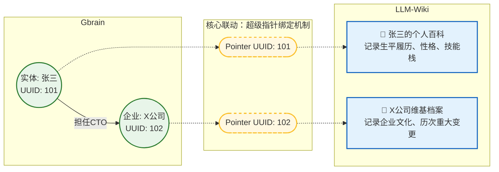
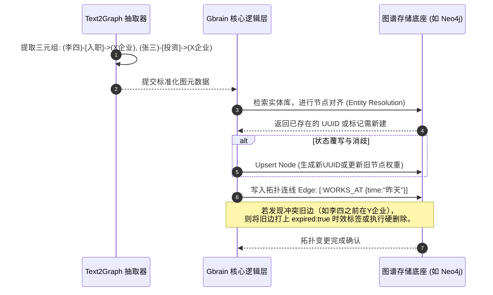
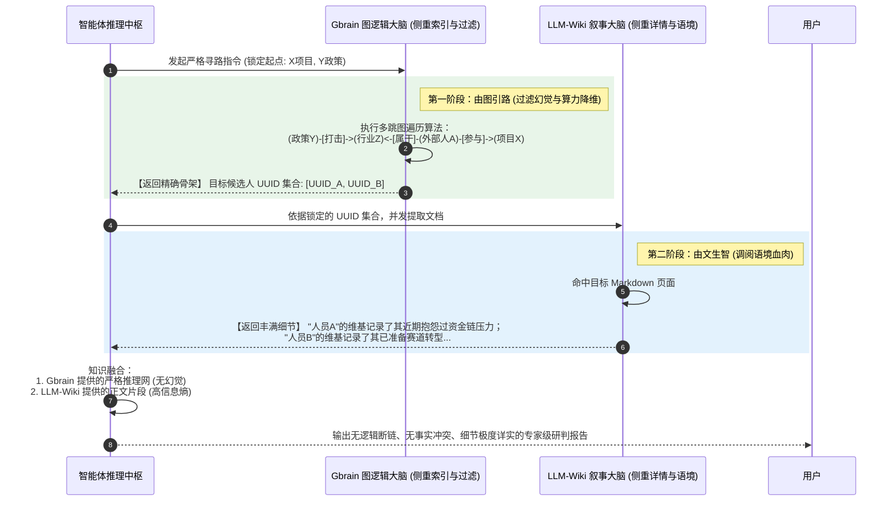

本文档深度剖析这两大核心组件的技术实现、内部运行机理、联合协同机制，及其对突破 Agent 智力上限的实际应用价值。

---

# 智能体核心认知引擎：Gbrain 与 LLM-Wiki 
## 深度技术架构与设计说明书 (V2.0 核心版)

**架构范式**：神经符号双过程引擎 (Neuro-symbolic Dual-Process)
**核心思想**：由图引路（降维逻辑寻址），由文生智（升维语境深读）

---

### 1. 架构核心上下文：双过程认知理论映射

在面对跨度长、逻辑深、常识要求高的复杂任务时，纯文本的大模型上下文窗口极易发生“注意力稀释”，而单纯的向量检索（Naive RAG）则会导致逻辑断链与事实冲突。

本架构将智能体的长期记忆剥离为“刚性逻辑”与“柔性叙事”两个深层耦合的组件。Gbrain 与 LLM-Wiki 虽在物理存储上隔离，但在逻辑语义上高度绑定：
*   **Gbrain (左脑)**：解决“是谁、在哪、什么关系”的拓扑确定性问题。
*   **LLM-Wiki (右脑)**：解决“怎么发生、细节如何、情感怎样”的语境丰富性问题。



---

### 2. Gbrain：图逻辑计算底座深度剖析

Gbrain 是 Agent 的“左脑”，它拒绝自然语言的模糊性，强制将输入信息降维转化为确定的拓扑网络，赋予 Agent 极强的抗幻觉能力与多跳推理跨度。

#### 2.1 核心功能模块设计
1.  **动态多模态抽取器 (Dynamic KG Extractor)**
    利用 LLM 与 VLM（视觉语言模型），在流式交互中执行实时 NER（命名实体识别）和 RE（关系抽取）。**特有能力**：支持将图像本身转化为独立节点（Image-as-a-Node），打通物理时空与逻辑网络，例如：`(User)-[APPEARS_IN]->(Image_001)<-[LOCATED_AT]-(会议室)`。
2.  **多跳游走路由中枢 (Multi-hop Routing Engine)**
    抛弃基于向量相似度的模糊匹配，采用图遍历算法（如 BFS、DFS、最短路径）或原生图查询语法（Cypher）。能够沿着确定的逻辑连线，穿透几十层关系网精准锁定目标（例如：找出A公司离职高管参与的所有B行业竞品项目），彻底过滤无关噪音。
3.  **本体防漂移与自愈引擎 (Ontology Anti-Drift Engine)**
    后台静默运行的自治理服务。基于 Louvain 等社群发现算法与向量聚类，定期扫描图谱，识别并合并高度相似的冗余节点（如合并“Apple Inc.”与“苹果公司”），触发大模型裁判执行**静默的图边折叠**，遏制图谱随时间发生的“肿瘤式膨胀”。

#### 2.2 数据处理流程 (知识摄入与组装)
当 Agent 接收到新知识（如：*“李四昨天加入了张三投资的X企业”*）时的处理链路：



#### 2.3 与其他系统的接口设计规范 (SPI)
Gbrain 对上层推理系统屏蔽底层具体图数据库的实现差异，暴露高度抽象的能力接口：
```python
class IGbrainInterface:
    def upsert_graph_elements(self, triples: List[TripleDTO]) -> GraphCommitResult:
        """摄入接口：写入三元组骨架，系统自动执行节点消歧与时序覆盖"""
        pass

    def semantic_pathfinding(self, start_uuid: str, constraint_filters: dict, max_depth: int) -> List[PathDTO]:
        """路由接口：给定起点，按照业务约束执行多跳游走，返回无幻觉的路径集合"""
        pass
        
    def human_override_edge(self, source_uuid: str, target_uuid: str, action: str) -> bool:
        """白盒干预接口：允许上层系统或人类手动剪断/建立实体连线，实施外科手术级纠偏"""
        pass
```

---

### 3. LLM-Wiki：长文叙事容器深度剖析

LLM-Wiki 是 Agent 的“右脑”，灵感来源于人类维基百科。它废除了大模型传统按时间线简单追加（Append-Only）杂乱日志的做法，确立了**“以实体为中心 (Entity-Centric)”**的动态知识库机制。

#### 3.1 知识组织方式 (Knowledge Organization)
每个 UUID 实体均对应一份独立的超媒体 Markdown 页面，采用**模块化区块骨架 (Section Schemas)** 组织：
*   **Frontmatter (元数据/属性区)**：记录实体的基本静态参数（如：年龄、当前状态、核心标签）及乐观锁版本号（Version Hash）。
*   **Core Summary (核心摘要区)**：Agent 高度浓缩提炼的百字核心特征画像。
*   **Chronicle Timeline (动态历程区)**：按时间倒序排列的重大事件记录，保留事件发生时的语境、长文本细节与情感色彩。
*   **Semantic Hyperlinks (语义超链接网络)**：文本中提及的其他实体，强制转换为 `[[实体名]](UUID:xxx)` 的形式，与 Gbrain 的节点连线形成完美映射。
*   **Multimodal Embeds (多模态画廊)**：以内联方式 `` 直接挂载相关视觉记忆。

#### 3.2 动态更新与冲突消解机制 (SSOT 机制)
传统的 RAG 库会同时堆叠“张三是CTO”和“张三离职了”两条矛盾文本，导致大模型精神分裂。LLM-Wiki 通过**“调阅-裁决-覆写 (Read-Reflect-Overwrite)”**机制实现唯一真实源（Single Source of Truth）：

1.  **调阅旧档 (Read)**：接收到状态变更信息后，后台唤醒 LLM，通过 UUID 拉取现存的“张三 Wiki 页面”。
2.  **LLM 充当编辑 (LLM-as-Editor)**：LLM 进行逻辑决断，主动将 `[摘要区]` 中的“CTO职位”删除，并在 `[动态历程区]` 补充一段详细的离职原因记录。
3.  **乐观并发覆写 (OCC Write)**：生成全新的 Markdown 正文，携带旧版本 Hash 提交给文档数据库，**全量覆盖旧数据**（旧版转入历史快照）。物理抹除过期事实，确保记忆库永远连贯自洽。

#### 3.3 核心应用场景
*   **超长生命周期陪伴 Agent**：用长文细致记录用户数年间的性格演变、情感偏好。无论对话跨度多长，Agent 的人设永远连贯，且能像老友一样提起极具温度的细枝末节。
*   **开放世界 NPC 剧情引擎**：数百个 NPC 共享一个“世界观 Wiki”并各自维护“个人 Wiki”。当沙盒发生重大事件（如城堡爆炸），大事件 Wiki 被覆写，所有 NPC 重新阅读后，行为瞬间涌现出全局一致的恐慌与撤离状态。

---

### 4. 协同架构工作流：图文一体化联合推理

Gbrain 和 LLM-Wiki 单独作战均有致命缺陷：图谱缺乏常识语境，维基搜索算力消耗极大。两者的深度耦合，即**“由图引路，由文生智”**，是完成极高复杂度认知任务的终极形态。

**典型长链路业务挑战**：*“分析过去半年与我共同推进X项目的外部人员中，谁最可能受到近期Y政策风波的波及？请给出详细依据。”*



---

### 5. 核心技术价值与业务突破总结

将智能体的记忆架构彻底收敛于 **Gbrain 与 LLM-Wiki 的双擎集成**，带来了传统单一模态路线无法企及的工程级突破：

1.  **指数级降低 Token 消耗与推理延迟**：放弃了让大模型在几十万字上下文中盲目“大海捞针”。Gbrain 的图算法游走以极低的 CPU 消耗，将海量文本的检索范围瞬间坍缩至特定的几个 UUID。大模型只需精读这几页 Wiki，算力成本暴降。
2.  **物理级治愈“大模型精神分裂”**：Gbrain 负责动态修剪失效的逻辑连线，LLM-Wiki 负责彻底覆写矛盾的历史事实。这种“双重确权与更新”机制，保障了智能体在长期无人值守的运行中，世界观绝对不崩溃。
3.  **赋予系统 100% 白盒化的人类干预权**：神经网络大模型的百亿参数是无法解释的黑盒，但 Gbrain 渲染出的拓扑连线，以及 LLM-Wiki 的纯文本 Markdown 页面，对人类开发者完全透明。必要时，人类可以直接“剪断错误的图连线”或“删改一句维基文本”，即刻对 Agent 的认知实施最高权限的“脑外科手术级”纠偏。这是 AI 迈向金融风控、医疗诊断等严监管深水区的核心信任基石。
